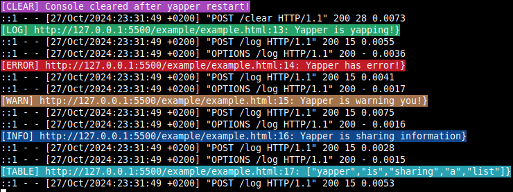

# Yapper
## Why?
- So you can see debugging messages without opening new 'inspect element'-window everytime you make changes to your browser extension

## How?
1. Start the server:
```
ruby server.js    #or make it executable
```
2. Add yapper.js to your project:
```
<script src="yapper.js"></script>
<script src="other.js"></script>
...
```
3. If using example.html, you should see the following:<br>


## Things to consider
- Make sure that the server is running, otherwise you will get spammed with error messages